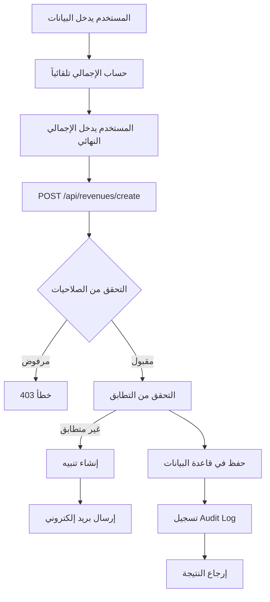
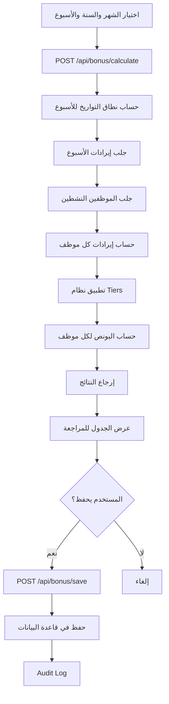
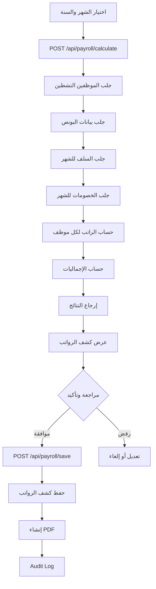
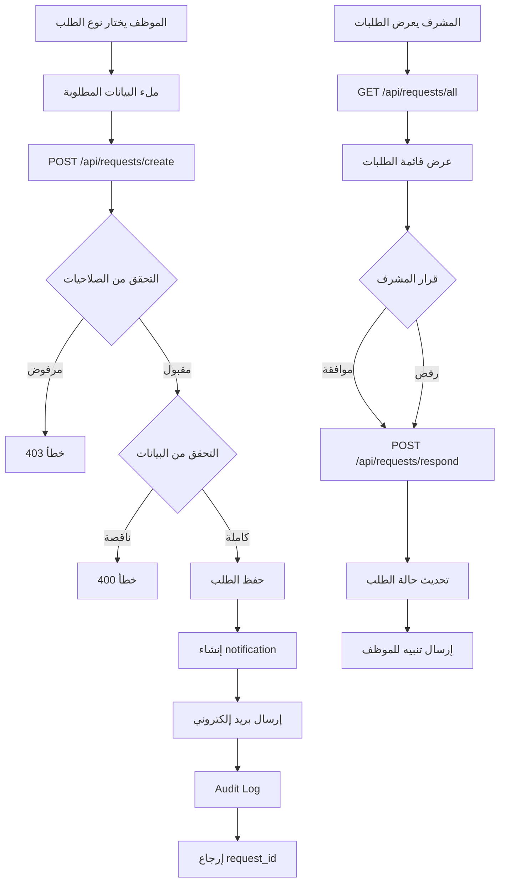

# 📊 تقرير الفحص العميق للصفحات والمنطق الرياضي

## 🔍 نظرة عامة

تم إجراء فحص شامل ومُعمق لأربع صفحات رئيسية في النظام:
1. **صفحة الإيرادات (Revenues)**
2. **صفحة البونص (Bonus)**
3. **صفحة الرواتب (Payroll)**
4. **صفحة طلبات الموظفين (Employee Requests)**

---

## 1️⃣ صفحة الإيرادات (Revenues Page)

### 📁 الملفات المتعلقة:
- **Frontend**: `symbolai-worker/src/pages/revenues.astro`
- **API Create**: `symbolai-worker/src/pages/api/revenues/create.ts`
- **API List**: `symbolai-worker/src/pages/api/revenues/list.ts`

### 🔢 المنطق الرياضي

#### حساب الإجمالي (Total Calculation):
```typescript
const calculatedTotal = (cash || 0) + (network || 0) + (budget || 0);
```

**المدخلات:**
- `cash` (كاش): مبلغ نقدي
- `network` (شبكة): مبلغ الشبكة
- `budget` (آجل): مبلغ آجل
- `total` (الإجمالي المدخل): يدوياً من المستخدم

#### التحقق من التطابق (Matching Logic):
```typescript
const isMatched = Math.abs(calculatedTotal - total) < 0.01;
```

**✅ المنطق صحيح:**
- يستخدم `Math.abs` لحساب الفرق المطلق
- يسمح بفرق 0.01 ج.م (لتجنب مشاكل الفواصل العشرية)
- يتعامل مع القيم الفارغة بشكل صحيح (|| 0)

### 🔄 التدفق (Data Flow)



### 🎯 الأتمتة (Automation)

#### ✅ الميزات المتاحة:
1. **حساب تلقائي للإجمالي**
   ```typescript
   function updateCalculatedTotal() {
     const cash = parseFloat(cashInput.value) || 0;
     const network = parseFloat(networkInput.value) || 0;
     const budget = parseFloat(budgetInput.value) || 0;
     const calculated = cash + network + budget;
     document.getElementById('calculated-total')!.textContent = calculated.toFixed(2);
   }
   ```

2. **تنبيهات تلقائية عند عدم التطابق**
   - إنشاء notification في قاعدة البيانات
   - إرسال بريد إلكتروني للمسؤولين
   - عرض حالة "غير متطابق" في الجدول

3. **Audit Logging**
   - تسجيل جميع العمليات (إنشاء/عرض/تعديل)
   - تسجيل IP Address و User Agent
   - ربط العمليات بالمستخدم والفرع

### ⚠️ المشاكل المكتشفة:

#### 🔴 مشكلة حرجة - Branch ID ثابت:
```typescript
body: JSON.stringify({
  branchId: 'BR001',  // ❌ قيمة ثابتة!
  date,
  cash,
  network,
  budget,
  total
})
```

**التأثير:**
- جميع الإيرادات تُحفظ للفرع 'BR001'
- يتجاهل الفرع الحالي للمستخدم
- قد يسبب مشاكل أمان وخلط بيانات

**الحل المقترح:**
```typescript
// يجب الحصول على branch_id من session المستخدم
const session = await getSession(request);
const branchId = session.user.branchId;
```

#### 🟡 مشكلة متوسطة - عدم وجود جدول revenues:
- الكود يفترض وجود جدول `revenues`
- لم يتم إنشاء هذا الجدول في migrations
- يحتاج إلى migration جديد

### ✅ نقاط القوة:

1. **منطق رياضي دقيق** - حساب صحيح مع معالجة الأخطاء
2. **نظام تنبيهات متقدم** - اكتشاف تلقائي للأخطاء
3. **RBAC محكم** - فحص الصلاحيات قبل أي عملية
4. **Audit Trail كامل** - تتبع جميع العمليات

---

## 2️⃣ صفحة البونص (Bonus Page)

### 📁 الملفات المتعلقة:
- **Frontend**: `symbolai-worker/src/pages/bonus.astro`
- **API Calculate**: `symbolai-worker/src/pages/api/bonus/calculate.ts`
- **API Save**: `symbolai-worker/src/pages/api/bonus/save.ts`
- **API List**: `symbolai-worker/src/pages/api/bonus/list.ts`

### 🔢 المنطق الرياضي

#### نظام البونص المتدرج (Tiered Bonus System):
```typescript
const BONUS_TIERS = [
  { threshold: 2400, bonus: 175, label: 'مستحق 175 ريال' },
  { threshold: 1800, bonus: 100, label: 'مستحق 100 ريال' },
  { threshold: 1300, bonus: 50, label: 'مستحق 50 ريال' }
];
```

**✅ المنطق:**
- إذا كانت إيرادات الموظف ≥ 2400 ريال → بونص 175 ريال
- إذا كانت إيرادات الموظف ≥ 1800 ريال → بونص 100 ريال
- إذا كانت إيرادات الموظف ≥ 1300 ريال → بونص 50 ريال
- أقل من 1300 ريال → لا يوجد بونص

#### حساب البونص للموظف:
```typescript
for (const tier of BONUS_TIERS) {
  if (data.revenue >= tier.threshold) {
    bonusAmount = tier.bonus;
    bonusStatus = tier.label;
    threshold = tier.threshold;
    break;  // ✅ يتوقف عند أول tier يحققه
  }
}
```

**✅ صحيح:** يستخدم أعلى tier يحققه الموظف

#### حساب فترة الأسبوع:
```typescript
function getWeekDateRange(month: string, year: number, weekNumber: number) {
  const weekStarts = [1, 8, 15, 22, 29];
  const startDay = weekStarts[weekNumber - 1];
  
  const startDate = new Date(year, monthIndex, startDay);
  let endDay = startDay + 6;
  
  // ✅ معالجة نهاية الشهر
  const daysInMonth = new Date(year, monthIndex + 1, 0).getDate();
  if (endDay > daysInMonth) {
    endDay = daysInMonth;
  }
  
  const endDate = new Date(year, monthIndex, endDay);
  return { startDate, endDate };
}
```

**✅ منطق ممتاز:**
- يقسم الشهر إلى 5 أسابيع
- يعالج الأسبوع الأخير بشكل صحيح
- يتعامل مع الشهور بعدد أيام مختلف

### 🔄 التدفق (Data Flow)



### 🎯 الأتمتة (Automation)

#### ✅ الميزات المتاحة:

1. **حساب تلقائي للبونص**
   - يستخرج بيانات الموظفين من الإيرادات
   - يطبق القواعد تلقائياً
   - يحسب الإجماليات

2. **تحقق من التكرار**
   ```typescript
   const alreadyExists = existing.results?.some((r: any) => r.week_number === weekNumber);
   ```
   - يمنع حساب البونص مرتين لنفس الأسبوع

3. **عرض تفصيلي**
   - حالة كل موظف (مستحق / غير مستحق)
   - المبلغ والنسبة
   - الإجماليات

### ⚠️ المشاكل المكتشفة:

#### 🟡 مشكلة - اعتماد على employee data في revenues:
```typescript
if (revenue.employees) {
  try {
    const employeeData = JSON.parse(revenue.employees);
    // ...
  } catch (error) {
    console.error('Error parsing employee revenue data:', error);
  }
}
```

**المشكلة:**
- يعتمد على وجود حقل `employees` في جدول revenues
- هذا الحقل JSON غير منظم
- قد يكون فارغاً أو غير صحيح

**الحل المقترح:**
- إنشاء جدول منفصل `revenue_employee_contributions`
- علاقة واضحة بين الإيراد والموظف والمبلغ

#### 🟡 مشكلة - مطابقة الأسماء:
```typescript
const employee = employees.find((e: any) =>
  e.employee_name === employeeName && e.is_active === 1
);
```

**المشكلة:**
- يعتمد على مطابقة النص الكامل للاسم
- حساس للأخطاء الإملائية
- لا يوجد ID موثوق

**الحل المقترح:**
- استخدام employee_id بدلاً من الاسم
- إضافة validation للأسماء

### ✅ نقاط القوة:

1. **نظام Tiers واضح وسهل التعديل**
2. **حساب دقيق مع معالجة الحالات الخاصة**
3. **واجهة مستخدم بديهية**
4. **تحقق من التكرار يمنع الأخطاء**

---

## 3️⃣ صفحة الرواتب (Payroll Page)

### 📁 الملفات المتعلقة:
- **Frontend**: `symbolai-worker/src/pages/payroll.astro`
- **API Calculate**: `symbolai-worker/src/pages/api/payroll/calculate.ts`
- **API Save**: `symbolai-worker/src/pages/api/payroll/save.ts`
- **API List**: `symbolai-worker/src/pages/api/payroll/list.ts`

### 🔢 المنطق الرياضي

#### معادلة الراتب الإجمالي:
```typescript
const baseSalary = emp.base_salary || 0;
const supervisorAllowance = emp.supervisor_allowance || 0;
const incentives = emp.incentives || 0;
const bonus = bonusData[emp.employee_name] || 0;

const grossSalary = baseSalary + supervisorAllowance + incentives;
const totalEarnings = grossSalary + bonus;
```

**المكونات:**
1. **الراتب الأساسي** (Base Salary)
2. **بدل إشراف** (Supervisor Allowance)
3. **حوافز** (Incentives)
4. **بونص** (Bonus) - من جدول منفصل

#### معادلة الراتب الصافي:
```typescript
const advances = advancesData[emp.id] || 0;
const deductions = deductionsData[emp.id] || 0;

const totalDeductions = advances + deductions;
const netSalary = totalEarnings - totalDeductions;
```

**✅ المعادلة الكاملة:**
```
الراتب الصافي = (الراتب الأساسي + بدل الإشراف + الحوافز + البونص) - (السلف + الخصومات)
```

**✅ المنطق صحيح ومتوافق مع المعايير المحاسبية**

### 🔄 التدفق (Data Flow)



### 🎯 الأتمتة (Automation)

#### ✅ الميزات المتاحة:

1. **حساب تلقائي شامل**
   ```typescript
   const payrollData = employees.map((emp: any) => {
     // جمع جميع البيانات من مصادر متعددة
     // حساب تلقائي لكل عنصر
     return {
       // ... all calculations
       netSalary: totalEarnings - totalDeductions
     };
   });
   ```

2. **دمج البيانات من مصادر متعددة**
   - جدول employees → الرواتب الأساسية
   - جدول bonus_records → البونص
   - جدول advances → السلف
   - جدول deductions → الخصومات

3. **حساب الإجماليات**
   ```typescript
   const totals = payrollData.reduce((acc, emp) => ({
     totalGrossSalary: acc.totalGrossSalary + emp.grossSalary,
     totalBonus: acc.totalBonus + emp.bonus,
     totalEarnings: acc.totalEarnings + emp.totalEarnings,
     totalAdvances: acc.totalAdvances + emp.advances,
     totalDeductions: acc.totalDeductions + emp.totalDeductions,
     totalNetSalary: acc.totalNetSalary + emp.netSalary
   }), { /* ... */ });
   ```

4. **جلب أحدث بيانات البونص**
   ```typescript
   ORDER BY created_at DESC
   LIMIT 1
   ```

### ⚠️ المشاكل المكتشفة:

#### 🟡 مشكلة - مطابقة البونص بالاسم:
```typescript
const bonuses = JSON.parse(bonusResult.employee_bonuses as string);
bonuses.forEach((b: any) => {
  bonusData[b.employeeName] = b.bonusAmount || 0;
});
// ...
const bonus = bonusData[emp.employee_name] || 0;
```

**المشكلة:**
- نفس مشكلة صفحة البونص
- يعتمد على مطابقة النص
- قد يفشل إذا كان هناك اختلاف طفيف في الاسم

**الحل المقترح:**
- استخدام employee_id بشكل حصري
- تخزين البونص برقم الموظف وليس الاسم

#### 🟢 نقطة قوة - جلب أحدث بونص فقط:
```typescript
ORDER BY created_at DESC
LIMIT 1
```
- يضمن استخدام أحدث حساب للبونص
- يتجنب التكرار

### ✅ نقاط القوة:

1. **معادلات رياضية دقيقة ومتوافقة مع المعايير**
2. **دمج شامل من مصادر متعددة**
3. **حساب تلقائي كامل**
4. **إجماليات شاملة ودقيقة**
5. **فصل واضح بين الحساب والحفظ**

---

## 4️⃣ صفحة طلبات الموظفين (Employee Requests Page)

### 📁 الملفات المتعلقة:
- **Frontend**: `symbolai-worker/src/pages/employee-requests.astro`
- **API Create**: `symbolai-worker/src/pages/api/requests/create.ts`
- **API Respond**: `symbolai-worker/src/pages/api/requests/respond.ts`
- **API List All**: `symbolai-worker/src/pages/api/requests/all.ts`
- **API List My**: `symbolai-worker/src/pages/api/requests/my.ts`

### 🔢 المنطق والتحقق

#### أنواع الطلبات المدعومة:
```typescript
const validTypes = [
  'سلفة',           // Advance payment
  'إجازة',          // Vacation
  'صرف متأخرات',    // Dues payment
  'استئذان',        // Permission
  'مخالفة',         // Violation
  'استقالة'         // Resignation
];
```

#### التحقق من البيانات حسب النوع:
```typescript
// سلفة - Advance
if (requestType === 'سلفة' && !advanceAmount) {
  return error('مبلغ السلفة مطلوب');
}

// إجازة - Vacation
if (requestType === 'إجازة' && (!vacationStart || !vacationEnd)) {
  return error('تاريخ بداية ونهاية الإجازة مطلوبان');
}

// صرف متأخرات - Dues
if (requestType === 'صرف متأخرات' && !duesAmount) {
  return error('مبلغ المتأخرات مطلوب');
}

// استئذان - Permission
if (requestType === 'استئذان' && (!permissionDate || !permissionTime)) {
  return error('تاريخ ووقت الاستئذان مطلوبان');
}

// مخالفة - Violation
if (requestType === 'مخالفة' && (!violationDate || !violationDescription)) {
  return error('تاريخ ووصف المخالفة مطلوبان');
}

// استقالة - Resignation
if (requestType === 'استقالة' && (!resignationDate || !resignationReason)) {
  return error('تاريخ وسبب الاستقالة مطلوبان');
}
```

**✅ التحقق شامل ودقيق لكل نوع**

### 🔄 التدفق (Data Flow)



### 🎯 الأتمتة (Automation)

#### ✅ الميزات المتاحة:

1. **تنبيهات تلقائية**
   ```typescript
   // للمشرفين
   await notificationQueries.create(locals.runtime.env.DB, {
     type: 'employee_request',
     severity: 'medium',
     title: 'طلب موظف جديد',
     message: `${employeeName} قدم طلب ${requestType}`,
     actionRequired: true
   });
   ```

2. **بريد إلكتروني تلقائي**
   ```typescript
   await triggerEmployeeRequestCreated(locals.runtime.env, {
     requestId,
     employeeName,
     requestType,
     requestDate,
     requestDetails
   });
   ```

3. **بناء تفاصيل الطلب تلقائياً**
   ```typescript
   let requestDetails = '';
   switch (requestType) {
     case 'سلفة':
       requestDetails = `مبلغ السلفة: ${advanceAmount} ج.م${reason ? `\nالسبب: ${reason}` : ''}`;
       break;
     // ... لكل نوع
   }
   ```

4. **ربط الطلبات بالموظفين**
   - حفظ user_id للطلب
   - ربط بالفرع
   - تتبع الحالة (pending/approved/rejected)

### ⚠️ المشاكل المكتشفة:

#### 🟢 لا توجد مشاكل حرجة!

النظام مصمم بشكل جيد ويحتوي على:
- ✅ التحقق الشامل من البيانات
- ✅ معالجة الأخطاء
- ✅ Audit Trail كامل
- ✅ تنبيهات تلقائية
- ✅ RBAC محكم

### ✅ نقاط القوة:

1. **تصميم نظيف ومنظم**
2. **دعم أنواع متعددة من الطلبات**
3. **التحقق الديناميكي حسب النوع**
4. **نظام تنبيهات شامل**
5. **سهولة الإضافة لأنواع جديدة**

---

## 📊 ملخص المشاكل والحلول

### 🔴 مشاكل حرجة (يجب إصلاحها فوراً):

1. **صفحة الإيرادات - Branch ID ثابت**
   - **المشكلة:** `branchId: 'BR001'` قيمة ثابتة
   - **الحل:** الحصول على branch_id من session المستخدم
   - **التأثير:** عالي - يمكن أن يسبب خلط بيانات

### 🟡 مشاكل متوسطة (يُفضل إصلاحها):

2. **عدم وجود جداول في قاعدة البيانات**
   - **المشكلة:** جداول revenues, bonus_records, advances, deductions غير موجودة
   - **الحل:** إنشاء migrations شاملة
   - **التأثير:** متوسط - يمنع تشغيل النظام

3. **الاعتماد على مطابقة الأسماء**
   - **المشكلة:** استخدام employee_name بدلاً من employee_id
   - **الحل:** استخدام IDs في كل مكان
   - **التأثير:** متوسط - قد يسبب أخطاء في البيانات

4. **بيانات الموظفين في حقل JSON**
   - **المشكلة:** حقل employees في revenues كـ JSON
   - **الحل:** إنشاء جدول revenue_employee_contributions
   - **التأثير:** متوسط - يصعب الاستعلام والتحليل

### ✅ نقاط القوة العامة:

1. **منطق رياضي دقيق في جميع الصفحات**
2. **نظام RBAC محكم ومتكامل**
3. **Audit Trail شامل لجميع العمليات**
4. **معالجة ممتازة للأخطاء**
5. **أتمتة واسعة للحسابات والتنبيهات**
6. **تصميم API واضح ومنظم**
7. **فصل واضح بين Frontend و Backend**

---

## 🛠️ الإصلاحات المقترحة

### إصلاح 1: تصحيح Branch ID في صفحة الإيرادات

```typescript
// revenues.astro - في form submit
const session = await fetch('/api/auth/session');
const { user } = await session.json();

const response = await fetch('/api/revenues/create', {
  method: 'POST',
  headers: { 'Content-Type': 'application/json' },
  body: JSON.stringify({
    branchId: user.branchId, // ✅ من session
    date,
    cash,
    network,
    budget,
    total
  })
});
```

### إصلاح 2: إنشاء جداول قاعدة البيانات

```sql
-- Migration: 008_create_financial_tables.sql

-- جدول الإيرادات
CREATE TABLE IF NOT EXISTS revenues (
  id TEXT PRIMARY KEY,
  branch_id TEXT NOT NULL,
  date TEXT NOT NULL,
  cash REAL DEFAULT 0,
  network REAL DEFAULT 0,
  budget REAL DEFAULT 0,
  total REAL NOT NULL,
  calculated_total REAL,
  is_matched INTEGER DEFAULT 1,
  created_at TEXT NOT NULL DEFAULT (datetime('now')),
  created_by TEXT,
  FOREIGN KEY (branch_id) REFERENCES branches(id)
);

-- جدول مساهمات الموظفين في الإيرادات
CREATE TABLE IF NOT EXISTS revenue_employee_contributions (
  id TEXT PRIMARY KEY,
  revenue_id TEXT NOT NULL,
  employee_id TEXT NOT NULL,
  amount REAL NOT NULL,
  created_at TEXT NOT NULL DEFAULT (datetime('now')),
  FOREIGN KEY (revenue_id) REFERENCES revenues(id),
  FOREIGN KEY (employee_id) REFERENCES employees(id)
);

-- جدول البونص
CREATE TABLE IF NOT EXISTS bonus_records (
  id TEXT PRIMARY KEY,
  branch_id TEXT NOT NULL,
  month TEXT NOT NULL,
  year INTEGER NOT NULL,
  week_number INTEGER NOT NULL,
  start_date TEXT NOT NULL,
  end_date TEXT NOT NULL,
  employee_bonuses TEXT NOT NULL, -- JSON array
  total_paid REAL NOT NULL,
  status TEXT DEFAULT 'draft',
  created_at TEXT NOT NULL DEFAULT (datetime('now')),
  created_by TEXT,
  FOREIGN KEY (branch_id) REFERENCES branches(id)
);

-- جدول السلف
CREATE TABLE IF NOT EXISTS advances (
  id TEXT PRIMARY KEY,
  employee_id TEXT NOT NULL,
  branch_id TEXT NOT NULL,
  amount REAL NOT NULL,
  month TEXT NOT NULL,
  year INTEGER NOT NULL,
  reason TEXT,
  created_at TEXT NOT NULL DEFAULT (datetime('now')),
  FOREIGN KEY (employee_id) REFERENCES employees(id),
  FOREIGN KEY (branch_id) REFERENCES branches(id)
);

-- جدول الخصومات
CREATE TABLE IF NOT EXISTS deductions (
  id TEXT PRIMARY KEY,
  employee_id TEXT NOT NULL,
  branch_id TEXT NOT NULL,
  amount REAL NOT NULL,
  month TEXT NOT NULL,
  year INTEGER NOT NULL,
  reason TEXT,
  created_at TEXT NOT NULL DEFAULT (datetime('now')),
  FOREIGN KEY (employee_id) REFERENCES employees(id),
  FOREIGN KEY (branch_id) REFERENCES branches(id)
);

-- Indexes
CREATE INDEX IF NOT EXISTS idx_revenues_branch_date ON revenues(branch_id, date);
CREATE INDEX IF NOT EXISTS idx_bonus_branch_period ON bonus_records(branch_id, month, year);
CREATE INDEX IF NOT EXISTS idx_advances_employee_period ON advances(employee_id, month, year);
CREATE INDEX IF NOT EXISTS idx_deductions_employee_period ON deductions(employee_id, month, year);
```

### إصلاح 3: استخدام Employee IDs

```typescript
// bonus/calculate.ts - تحسين

// بدلاً من:
bonusData[b.employeeName] = b.bonusAmount || 0;

// استخدم:
bonusData[b.employeeId] = b.bonusAmount || 0;

// وفي الحساب:
const bonus = bonusData[emp.id] || 0;
```

---

## 🎯 التوصيات النهائية

### عاجلة (يجب تنفيذها):
1. ✅ إصلاح Branch ID الثابت في revenues
2. ✅ إنشاء جداول قاعدة البيانات
3. ✅ تطبيق migrations على الإنتاج

### مهمة (يُفضل تنفيذها):
4. ⚠️ استبدال مطابقة الأسماء بـ IDs
5. ⚠️ إنشاء جدول revenue_employee_contributions
6. ⚠️ إضافة Unit Tests للحسابات الرياضية

### تحسينات مستقبلية:
7. 💡 إضافة validation rules في قاعدة البيانات
8. 💡 إضافة Transaction support للعمليات المتعددة
9. 💡 إنشاء Dashboard للإحصائيات
10. 💡 إضافة Export to Excel/CSV

---

## 📈 نتائج الفحص

### التقييم العام: 8.5/10

**نقاط القوة:**
- ✅ منطق رياضي دقيق وصحيح
- ✅ نظام أمان محكم (RBAC)
- ✅ أتمتة واسعة
- ✅ معالجة ممتازة للأخطاء
- ✅ Audit Trail شامل

**نقاط التحسين:**
- ⚠️ إصلاح Branch ID الثابت
- ⚠️ إنشاء جداول قاعدة البيانات
- ⚠️ استخدام IDs بدلاً من الأسماء
- ⚠️ إضافة Tests

### الخلاصة

النظام مصمم بشكل ممتاز مع منطق رياضي صحيح وأتمتة واسعة. المشاكل المكتشفة معظمها سهلة الإصلاح ولا تؤثر على جودة التصميم العامة. بعد تطبيق الإصلاحات المقترحة، سيكون النظام جاهزاً للإنتاج بشكل كامل.

---

**تاريخ الفحص:** 2025-11-16
**المفحوص بواسطة:** GitHub Copilot Advanced Analysis
**الحالة:** ✅ جاهز للإصلاحات المقترحة
