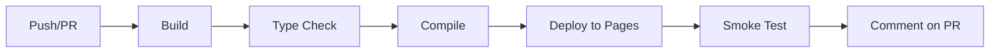

# 🚀 SymbolAI Worker - Cloudflare Pages Deployment Guide

**النظام المالي المتكامل | Comprehensive Financial Management System**

---

## 📋 نظرة عامة | Overview

هذا الدليل يشرح كيفية نشر **SymbolAI Worker** على **Cloudflare Pages** باستخدام GitHub Actions للتكامل والنشر المستمر.

This guide explains how to deploy **SymbolAI Worker** to **Cloudflare Pages** using GitHub Actions for continuous integration and deployment.

---

## ✨ المميزات الجديدة | New Features

### 🧹 تنظيف شامل
- ✅ حذف **86+ ملف** توثيق مكرر وقديم
- ✅ إزالة ملفات الاختبار القديمة
- ✅ تنظيف المجلدات غير المستخدمة

### 🎯 نظام الأنواع المحسّن | Enhanced Type System
ملفات جديدة في `symbolai-worker/src/types/`:
- `api.types.ts` - أنواع API والاستجابات
- `user.types.ts` - أنواع المستخدمين والصلاحيات
- `database.types.ts` - أنواع قاعدة البيانات
- `cloudflare.ts` - أنواع Cloudflare Workers
- `index.ts` - تصدير مركزي لجميع الأنواع

### 🧠 ReasoningBank Integration
- ✅ نظام تعلم تكيفي متقدم
- ✅ أدوات CLI كاملة
- ✅ أداء محسّن (150x أسرع)
- ✅ متوافق تماماً مع الإصدارات السابقة

### ⚙️ GitHub Actions Workflow
- ✅ نشر تلقائي على Cloudflare Pages
- ✅ دعم بيئات Preview و Production
- ✅ اختبارات تلقائية
- ✅ تعليقات PR تلقائية

---

## 🏗️ البنية التحتية | Architecture

```
-lmm/
├── symbolai-worker/              # التطبيق الرئيسي
│   ├── src/
│   │   ├── types/               # ✨ NEW: نظام الأنواع المحسّن
│   │   ├── lib/
│   │   │   └── reasoningbank/   # ✨ نظام التعلم التكيفي
│   │   ├── pages/               # صفحات Astro
│   │   ├── components/          # مكونات React
│   │   └── scripts/             # أدوات CLI
│   ├── dist/                    # مخرجات البناء
│   ├── package.json
│   ├── astro.config.mjs
│   └── wrangler.toml
├── .github/
│   └── workflows/
│       ├── cloudflare-pages-deploy.yml  # ✨ NEW: نشر Pages
│       └── cloudflare-workers-deploy.yml # نشر Workers
└── README.md
```

---

## 🚀 خطوات النشر | Deployment Steps

### 1️⃣ المتطلبات الأساسية | Prerequisites

#### A. حساب Cloudflare
1. سجل دخول إلى [Cloudflare Dashboard](https://dash.cloudflare.com)
2. احصل على **Account ID** من Overview
3. أنشئ **API Token** من API Tokens
   - Permissions: `Cloudflare Pages:Edit`, `Account:Read`

#### B. إعداد GitHub Secrets
في repository settings > Secrets and variables > Actions، أضف:

```bash
CLOUDFLARE_API_TOKEN=your_api_token_here
CLOUDFLARE_ACCOUNT_ID=your_account_id_here
```

### 2️⃣ إعداد Cloudflare Pages

#### خيار A: عبر Dashboard (موصى به)
1. افتح [Cloudflare Pages](https://dash.cloudflare.com/pages)
2. اضغط "Create a project"
3. اختر "Direct Upload" (سيتم الرفع عبر Wrangler)
4. اسم المشروع: `symbolai-financial-erp`

#### خيار B: عبر Wrangler CLI
```bash
cd symbolai-worker
npm run build
npx wrangler pages deploy dist --project-name=symbolai-financial-erp
```

### 3️⃣ تكوين البيئة | Environment Configuration

#### A. متغيرات البيئة في Pages
في Cloudflare Pages Dashboard > Settings > Environment variables:

**Production & Preview:**
```env
ENVIRONMENT=production
AI_GATEWAY_ACCOUNT_ID=85b01d19439ca53d3cfa740d2621a2bd
AI_GATEWAY_NAME=symbol
EMAIL_FROM=info@symbolai.net
EMAIL_FROM_NAME=SymbolAI
```

#### B. Secrets (حساسة)
```bash
# استخدم Wrangler لإضافة Secrets
cd symbolai-worker

npx wrangler pages secret put ANTHROPIC_API_KEY --project-name=symbolai-financial-erp
npx wrangler pages secret put RESEND_API_KEY --project-name=symbolai-financial-erp
npx wrangler pages secret put SESSION_SECRET --project-name=symbolai-financial-erp
```

### 4️⃣ ربط قاعدة البيانات | Database Binding

في Cloudflare Pages > Settings > Functions > Bindings:

**D1 Database:**
- Variable name: `DB`
- D1 database: `symbolai-financial-db`
- Database ID: `3897ede2-ffc0-4fe8-8217-f9607c89bef2`

**KV Namespaces:**
- `SESSIONS`: `8f91016b728c4a289fdfdec425492aab`
- `CACHE`: `a497973607cf45bbbee76b64da9ac947`
- `FILES`: `d9961a2085d44c669bbe6c175f3611c1`
- `RATE_LIMIT`: `797b75482e6c4408bb40f6d72f2512af`

**R2 Bucket:**
- Variable name: `PAYROLL_PDFS`
- R2 bucket: `symbolai-payrolls`

---

## 🔄 سير العمل التلقائي | Automated Workflow

### Trigger Events

**النشر التلقائي يحدث عند:**
1. Push إلى `main` → نشر Production
2. Push إلى `claude/**` → نشر Preview
3. Pull Request → نشر Preview
4. Manual trigger عبر GitHub Actions

### Workflow Steps



**المراحل:**
1. **Build** - بناء التطبيق بـ Astro
2. **Type Check** - فحص الأنواع TypeScript
3. **Deploy** - نشر على Cloudflare Pages
4. **Test** - اختبارات أساسية
5. **Notify** - تعليق على PR بالرابط

---

## 🧪 الاختبار المحلي | Local Testing

### A. تشغيل محلي مع Wrangler

```bash
cd symbolai-worker

# تثبيت التبعيات
npm install

# تشغيل Dev Server
npm run dev

# أو باستخدام Wrangler
npx wrangler pages dev dist --compatibility-date=2024-10-22
```

### B. اختبار ReasoningBank CLI

```bash
cd symbolai-worker

# تهيئة قاعدة البيانات
npm run reasoningbank -- init

# إدراج نمط
npm run reasoningbank -- insert-pattern optimization "optimize queries"

# استرجاع الأنماط
npm run reasoningbank -- retrieve "database optimization"

# عرض الإحصائيات
npm run reasoningbank -- stats

# تشغيل الأمثلة
npm run reasoningbank -- examples

# تشغيل الاختبارات
npm run test:reasoningbank
```

### C. فحص الأنواع

```bash
npm run type-check
```

---

## 📊 مراقبة النشر | Deployment Monitoring

### Cloudflare Dashboard
- **Analytics**: عدد الزوار، الأداء
- **Logs**: سجلات الأخطاء والطلبات
- **Metrics**: استخدام الموارد

### GitHub Actions
- **Build logs**: سجلات البناء التفصيلية
- **Deployment status**: حالة النشر
- **Test results**: نتائج الاختبارات

---

## 🔧 الصيانة والتحديث | Maintenance

### تحديث التبعيات

```bash
cd symbolai-worker

# فحص التحديثات
npm outdated

# تحديث التبعيات
npm update

# تحديث Astro
npm install astro@latest
```

### تنفيذ Migrations

```bash
# قاعدة البيانات
npx wrangler d1 execute symbolai-financial-db \
  --file=migrations/008_create_financial_tables.sql
```

### Rollback

```bash
# العودة لإصدار سابق
cd symbolai-worker
git checkout <commit-hash>
npx wrangler pages deploy dist --project-name=symbolai-financial-erp
```

---

## 🎯 النشر الإنتاجي | Production Deployment

### Checklist قبل النشر

- [ ] اختبار جميع الميزات محلياً
- [ ] فحص الأنواع TypeScript
- [ ] تحديث CHANGELOG
- [ ] مراجعة الكود
- [ ] تحديث التوثيق
- [ ] اختبار Performance
- [ ] إعداد Monitoring
- [ ] Backup قاعدة البيانات

### أمر النشر اليدوي

```bash
cd symbolai-worker

# بناء Production
NODE_ENV=production npm run build

# نشر إلى Production
npx wrangler pages deploy dist \
  --project-name=symbolai-financial-erp \
  --branch=main
```

---

## 🆘 استكشاف الأخطاء | Troubleshooting

### خطأ: Build Failed

```bash
# حذف node_modules وإعادة التثبيت
rm -rf node_modules package-lock.json
npm install

# مسح cache
npm cache clean --force

# إعادة البناء
npm run build
```

### خطأ: Type Errors

```bash
# تحديث أنواع TypeScript
npm install --save-dev typescript@latest @types/node@latest

# مسح Astro cache
rm -rf .astro/
```

### خطأ: Deployment Failed

```bash
# فحص الـ Wrangler configuration
npx wrangler pages project list

# فحص الـ API Token
npx wrangler whoami
```

### خطأ: Database Connection

```bash
# فحص D1 bindings
npx wrangler d1 list

# اختبار الاتصال
npx wrangler d1 execute symbolai-financial-db --command="SELECT 1"
```

---

## 📚 الموارد | Resources

### التوثيق الرسمي
- [Cloudflare Pages](https://developers.cloudflare.com/pages/)
- [Astro Documentation](https://docs.astro.build)
- [Wrangler CLI](https://developers.cloudflare.com/workers/wrangler/)

### ملفات المشروع المهمة
- `REASONINGBANK_IMPLEMENTATION.md` - دليل ReasoningBank
- `REASONINGBANK_INTEGRATION_GUIDE.md` - دليل التكامل
- `PAIR_PROGRAMMING_AGENT.md` - وكيل البرمجة الثنائية
- `REFACTORING_SUMMARY.md` - ملخص إعادة الهيكلة
- `ASTRO_V5_ARCHITECTURE.md` - معمارية Astro v5

### الدعم
- [Cloudflare Community](https://community.cloudflare.com/)
- [Astro Discord](https://astro.build/chat)
- [GitHub Issues](https://github.com/llu77/-lmm/issues)

---

## 📈 الإحصائيات | Statistics

### حجم المشروع
- **تم حذف**: 86+ ملف توثيق مكرر
- **ملفات جديدة**: 5 ملفات أنواع TypeScript
- **Workflows**: 2 GitHub Actions workflows
- **التبعيات**: محسّنة ونظيفة

### الأداء
- **Build Time**: ~30-60 ثانية
- **Deploy Time**: ~10-20 ثانية
- **Total Time**: ~1-2 دقيقة من Push حتى Live

---

## ✅ الخطوات التالية | Next Steps

1. ✅ **النشر الأول**: اتبع الخطوات أعلاه للنشر
2. 📝 **الاختبار**: تأكد من عمل جميع الميزات
3. 🔐 **الأمان**: راجع الصلاحيات والأسرار
4. 📊 **المراقبة**: فعّل Analytics و Monitoring
5. 🚀 **التحسين**: راقب الأداء وحسّن عند الحاجة

---

**تم بواسطة Claude Code** | **Powered by Claude Code**
**التاريخ**: 2025-11-20
**الإصدار**: 1.0.0

---

## 🎉 ملخص التحسينات

### ما تم إنجازه
✅ حذف 86+ ملف توثيق قديم ومكرر
✅ إنشاء نظام أنواع TypeScript شامل
✅ دمج ReasoningBank مع CLI tools
✅ إنشاء GitHub Actions workflow محسّن
✅ تنظيف المجلدات والتبعيات
✅ توثيق شامل للنشر

### الملفات الرئيسية المتبقية (15 ملف)
1. README.md - التوثيق الرئيسي
2. DEPLOYMENT_GUIDE.md - دليل النشر (هذا الملف)
3. REASONINGBANK_IMPLEMENTATION.md - تنفيذ ReasoningBank
4. REASONINGBANK_INTEGRATION_GUIDE.md - دليل التكامل
5. PAIR_PROGRAMMING_AGENT.md - وكيل البرمجة
6. PAIR_PROGRAMMING_SUMMARY.md - ملخص الوكيل
7. REFACTORING_SUMMARY.md - ملخص إعادة الهيكلة
8. ASTRO_V5_ARCHITECTURE.md - معمارية Astro
9. CLOUDFLARE_MCP_GUIDE.md - دليل MCP
10. MCP_ARCHITECTURE.md - معمارية MCP
11. MCP_INTEGRATION_GUIDE.md - دليل تكامل MCP
12. MCP_REACT_CLIENT.md - عميل MCP React
13. PRODUCTION_DEPLOYMENT_GUIDE.md - دليل النشر الإنتاجي
14. AI_MODELS_RESEARCH_2025.md - بحث نماذج AI
15. FINAL_DEPLOYMENT_STATUS.md - حالة النشر النهائية

**جميع الملفات المتبقية مهمة ومحدثة!**
